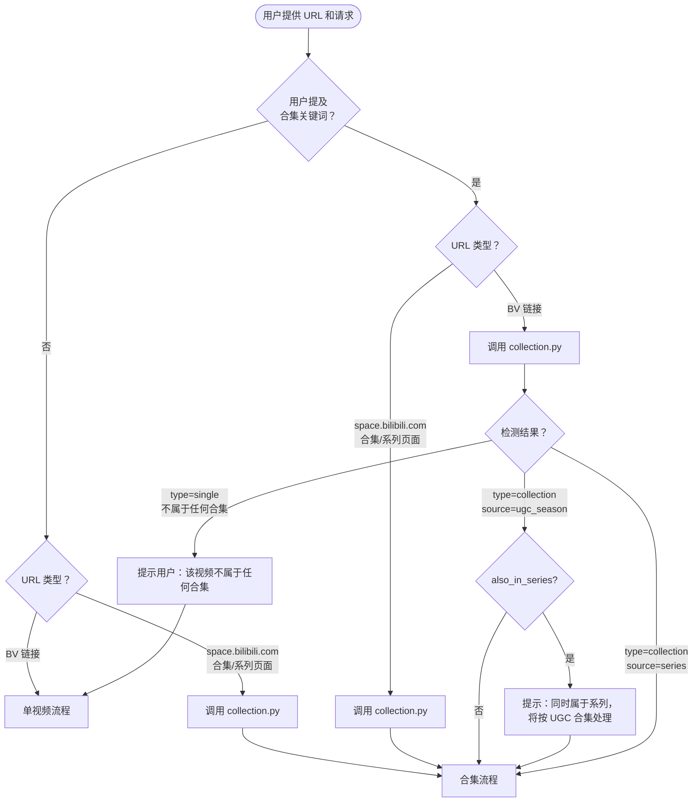
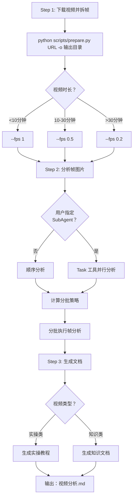
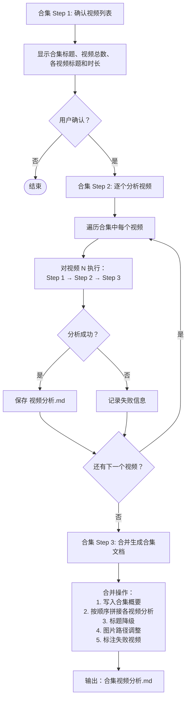
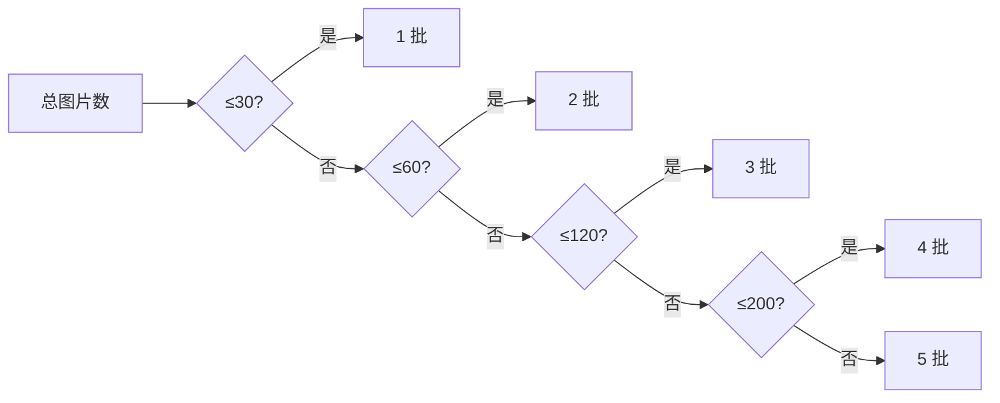
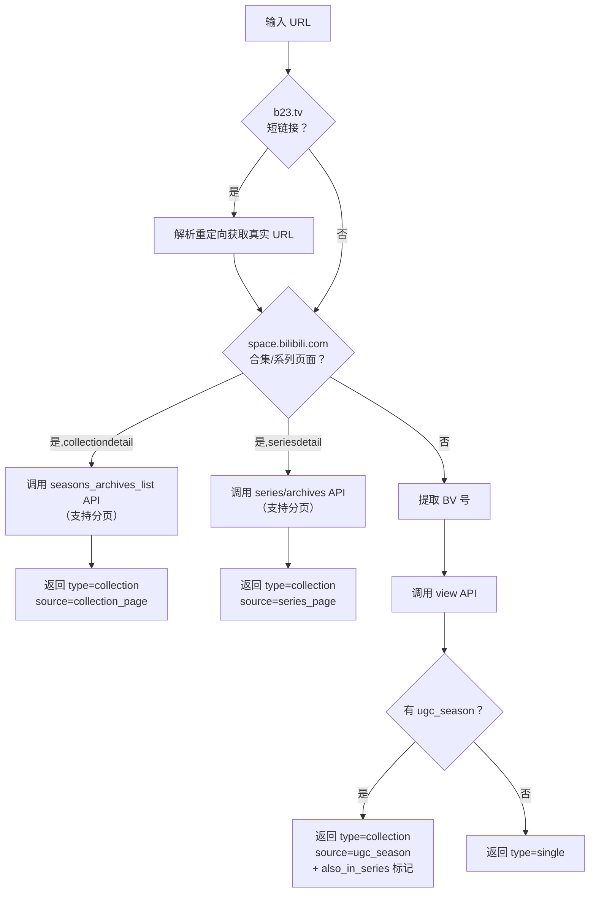

# Bilibili Analyzer 工作流程

## 1. 术语表

| 缩写/术语 | 英文全称 | 中文含义 |
|-----------|---------|----------|
| **BV** | Bilibili Video (ID) | B站视频唯一标识符，如 `BV15qD8BTEsD` |
| **UGC** | User Generated Content | 用户生成内容，指 UP 主自己创作上传的视频（区别于 B站采购的番剧） |
| **UGC 合集 / UGC Season** | UGC Season | UP 主在个人空间创建的视频合集，把多个独立 BV 视频归为一组 |
| **系列 / Series** | Series | B站另一种视频分组方式，功能类似合集但更松散 |
| **分P** | Part / Page | 一个 BV 视频内的多个分段（如"第1P"、"第2P"），共享同一个 BV 号 |
| **spm_id_from** | Super Position Model ID From | B站的来源追踪参数，记录用户从哪个页面点进来，不影响功能 |
| **vd_source** | Video Source | B站的用户追踪标识，不影响功能 |
| **view API** | View API | B站获取视频信息的接口，返回标题、UP主、分P列表、合集信息等 |
| **ugc_season** | UGC Season (字段名) | view API 返回数据中的一个字段，如果该视频属于 UGC 合集则包含合集内所有视频信息 |
| **mid** | Member ID | UP 主的用户ID（数字） |
| **cid** | Content ID | 视频内容 ID，每个分P有独立的 cid |
| **season_id / sid** | Season ID | 合集/系列的唯一编号 |

### 三种"分组"概念区分

| 概念 | 说明 | URL 特征 |
|------|------|----------|
| **分P** | 同一个 BV 视频内的多个片段 | `bilibili.com/video/BVxxx?p=2` |
| **UGC 合集** | 多个**不同 BV 视频**组成的集合 | 合集页: `space.bilibili.com/{mid}/channel/collectiondetail?sid=xxx` |
| **系列** | 另一种多 BV 视频分组 | 系列页: `space.bilibili.com/{mid}/channel/seriesdetail?sid=xxx` |

### URL 类型分类

| 类型 | URL 模式 | 示例 |
|------|---------|------|
| **BV 视频链接** | `bilibili.com/video/BVxxx...` | `https://www.bilibili.com/video/BV15qD8BTEsD?p=2` |
| **合集页面链接** | `space.bilibili.com/{mid}/channel/collectiondetail?sid={id}` | `https://space.bilibili.com/476048648/channel/collectiondetail?sid=12345` |
| **系列页面链接** | `space.bilibili.com/{mid}/channel/seriesdetail?sid={id}` | `https://space.bilibili.com/476048648/channel/seriesdetail?sid=67890` |
| **短链接** | `b23.tv/xxxxx` | `https://b23.tv/AbCdEf` |

## 2. 整体流程图



## 3. 单视频流程



## 4. 合集流程



## 5. 分批策略



## 6. collection.py 检测逻辑



## 7. 输出目录结构

### 单视频

```
<输出目录>/
├── video.mp4
├── images_raw/
├── images/
├── metadata.json
├── frames.json
└── 视频分析.md
```

### 合集

```
<合集输出目录>/
├── <视频1 BV号>/
│   ├── video.mp4
│   ├── images_raw/
│   ├── images/
│   ├── metadata.json
│   ├── frames.json
│   └── 视频分析.md
├── <视频2 BV号>/
│   └── ...
├── ...
└── 合集视频分析.md
```
