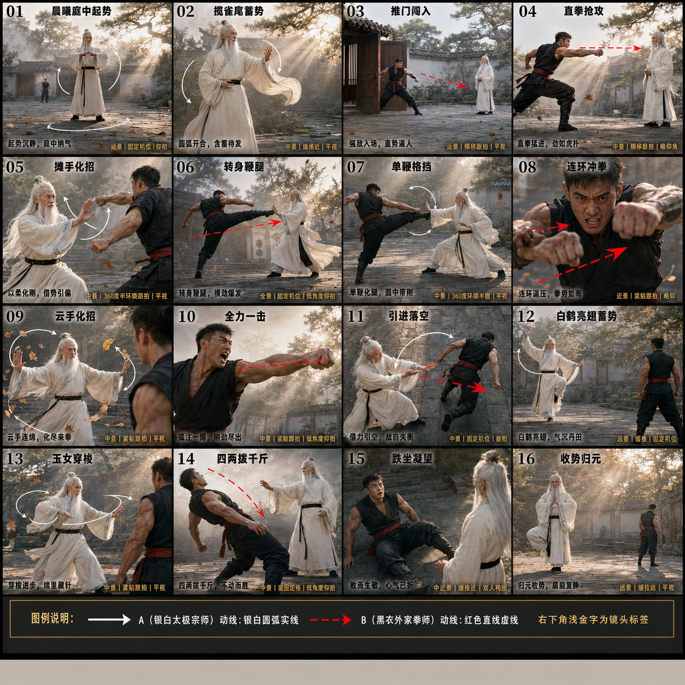
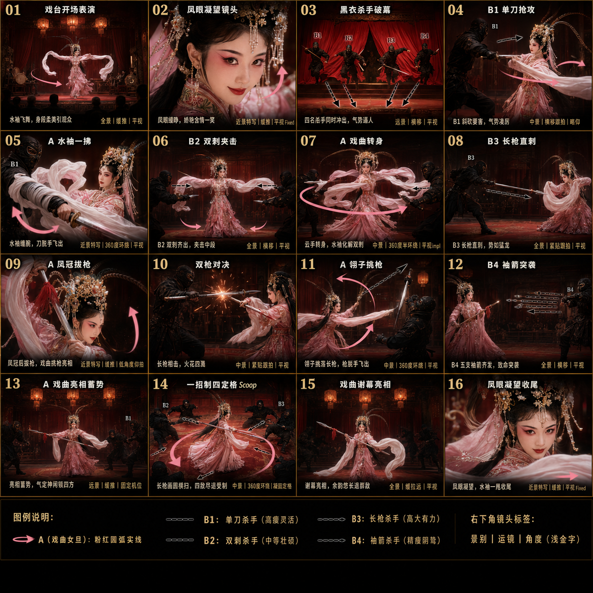
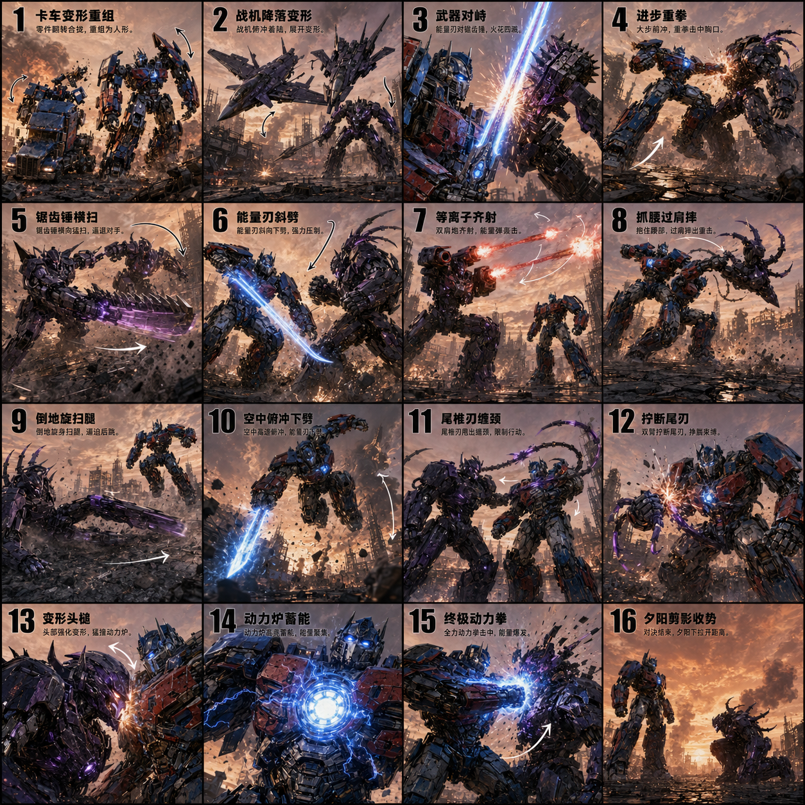
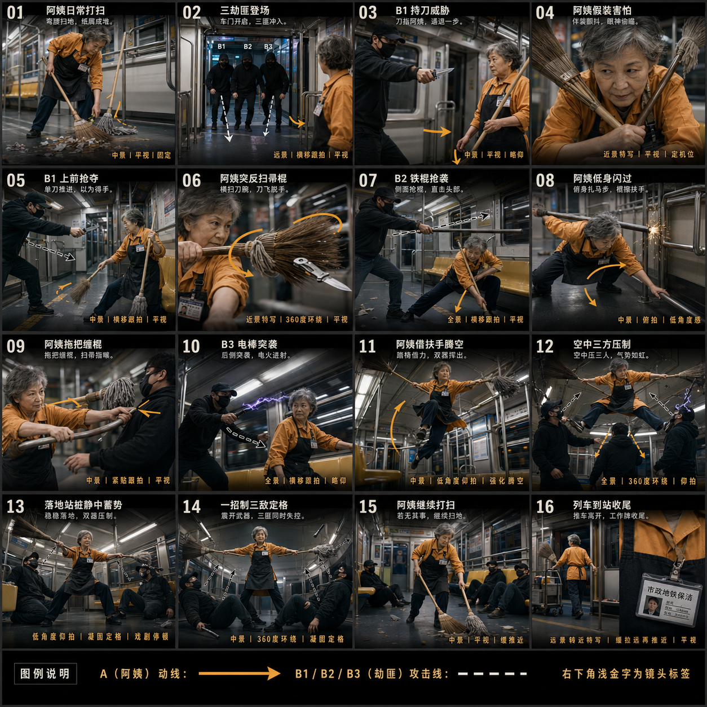
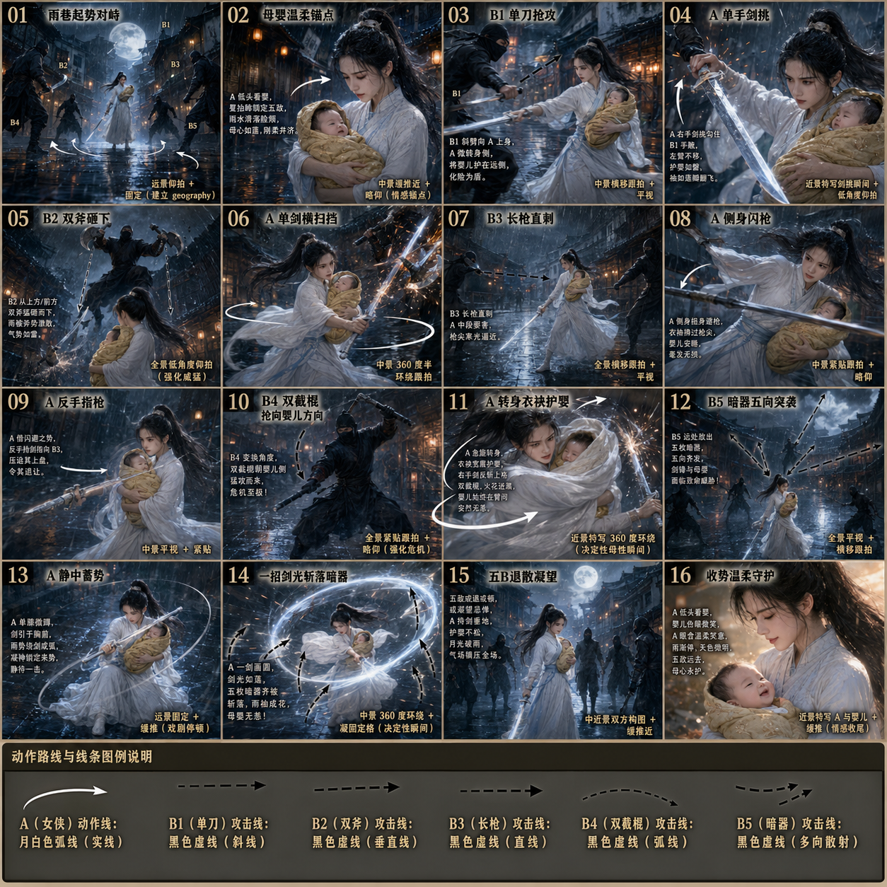
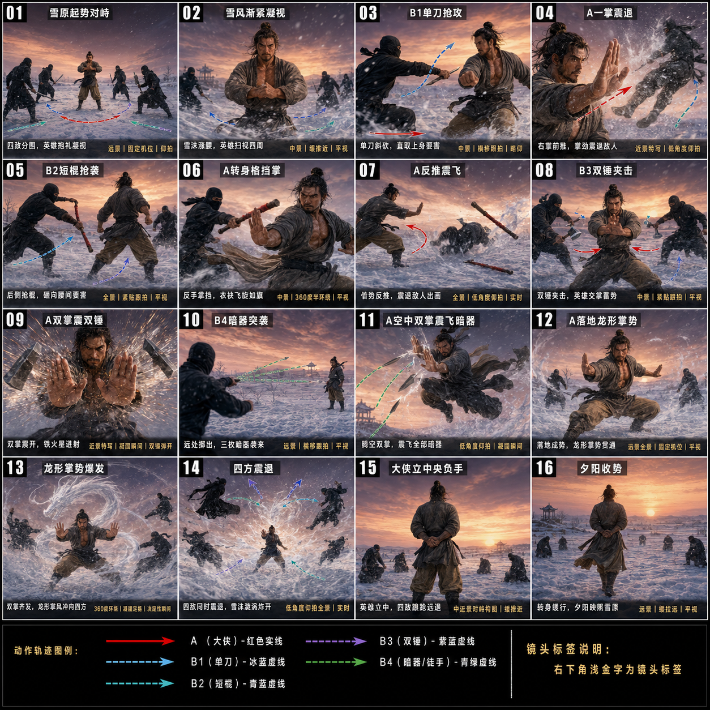
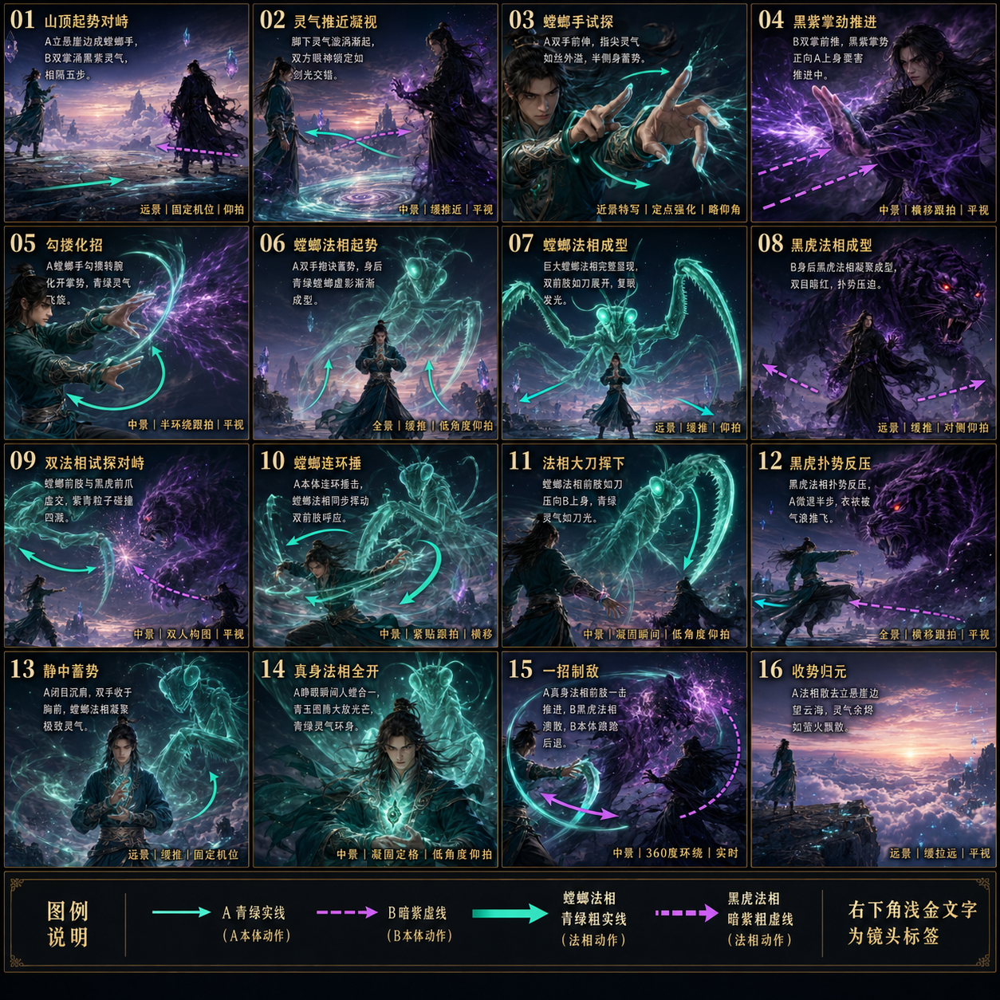
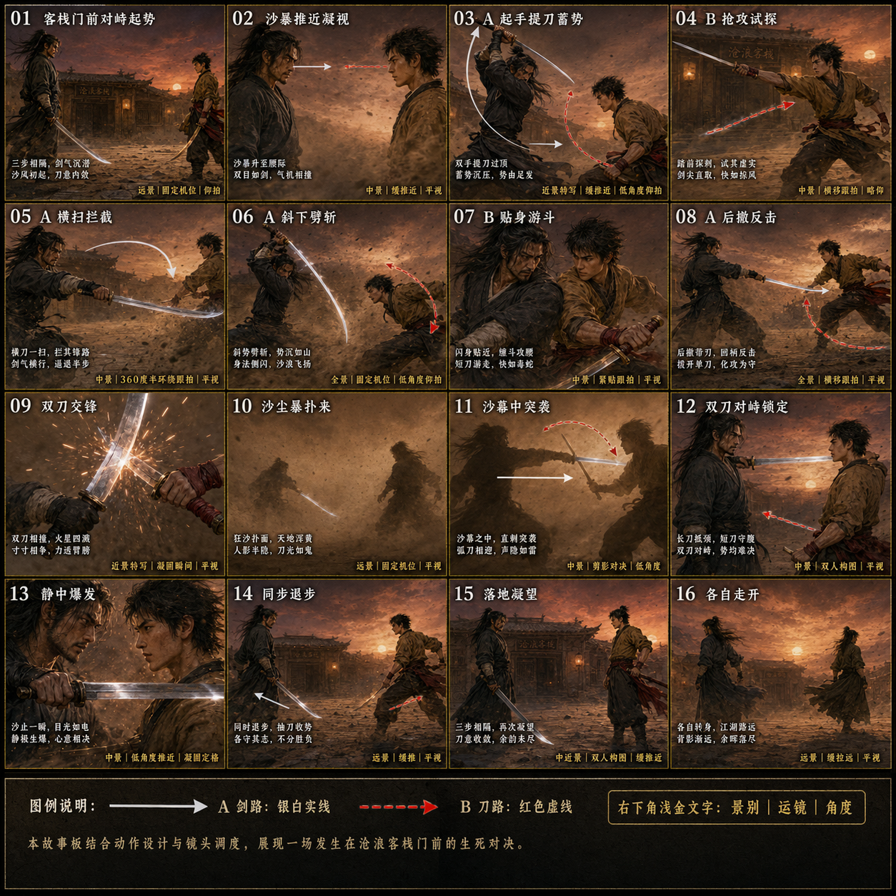

# martial-arts-director-cy

> 武术指导 Skill — 一句话需求生成 N 宫格武打分镜海报与视频提示词，覆盖武术、格斗、修真、戏曲、机甲等多类题材

## 关于这个 skill

最近我做了一个 AI 武术指导 skill，叫 `martial-arts-director-cy`，分享下。

起因是看到 AI 创作圈做武打题材的越来越多，但产出大多数还是外行水平：动作堆砌没节奏、16 格人物每格变脸、视频生成时一半招式被 AI 自动省略。还有一个隐性问题是合规，做机甲、做超英、做经典武侠常常会不知不觉踩到 IP 雷区，发到平台轻则限流重则下架。

skill 的工作方式很简单：一句话需求进去，两段提示词出来。一段是图像 prompt（4×4 = 16 格分镜海报），一段是视频 prompt（15 秒，用图作为参考图）。

它内置了三十多个武术、格斗、兵器、修真、戏曲门类的真实招式语料，十多种影视武指的镜头语言和节奏特征，一套"起势、冲突、化解、缠斗、制服、收势"的剧作节拍，工业级的动线箭头和镜头标签图例，以及一套让图视频严密咬合、关键招式不丢镜头的 i2v 协议。

合规上做了两层处理。一层是自动避开具体 IP 角色名（不会出现真人名字、动漫角色名、电影主角名），用通用视觉特征关键词去复刻那种感觉，出来的画面"像那些经典作品但不是任何一个具体 IP"。一层是自动软化暴力描述，用动作戏标准词汇（震退、化解、火花飞溅）替代血腥用语，发哪个平台都不会踩雷。

## 安装

```bash
git clone https://github.com/CY-CHENYUE/martial-arts-director-cy.git ~/.claude/skills/martial-arts-director-cy
```

## 触发关键词

"武术指导"、"武术分解海报"、"武打分镜"、"招式分解"、"N 宫格武术动作"、"武术套路海报"、"武术编舞海报"。

也适用于把现有舞蹈 / 动作分解海报提示词改写成武术版本。

## 工作流（5 步）

1. **信息收集** — 通过表格收集人物、武术体系、调性、服装、场景、宫格规格、兵器、影视参考等字段
2. **招式编排** — 根据宫格规格 + 武术体系 + 是否带兵器选择对应骨架，按"动态生成原则"做实质性定制
3. **组装多宫格海报提示词** — 输出可直接喂给绘图工具的中文提示词（700-1050 字符），默认渲染为高清写实线稿图（黑线白底、排线表达体积，可由 AI 还原为 8K IMAX 电影写实风格）
4. **生成视频提示词** — 输出 15 秒视频提示词（600-800 字符），含「参考图阅读协议」+「分镜执行清单」
5. **合规自检** — 自动审查 IP 雷区、暴力描述、平台中立性

## 真实案例

下面是 7 个真实案例，每个都是一句提示词跑出来的。

---

### 太极宗师 vs 外家拳师

黑衣拳师跌坐凝望白衣宗师，旁注六个字：「败而生敬，心一已折」。

很多人觉得 AI 出武打分镜，最多就是"出拳一、踢腿二、防御三"。做这个 skill 时我特意塞了一层东西：流派的哲学。太极对决，它不会写"A 打赢 B"，会写"以柔克刚、不动而胜"，胜负是精神层的，不是 KO。

整套 16 格按起势、来犯、化解、缠斗、制服、收势的节拍排，每格自带动线箭头（白线归太极、红线归外家）和镜头标签（360 度环绕、紧贴跟拍、低角度俯拍）。这是武指工作单的标配，也是 skill 的默认产出格式。

输入是一句话："太极宗师对外家拳师，晨曦庭院，要有太极哲学"。




---

### 戏曲女旦 vs 四名杀手

戏曲和武打硬凑容易翻车，skill 给了一个"戏中戏"的框架去装：开场戏台表演吸引观众，中段被杀手破幕入侵，结尾戏曲谢幕亮相退群敌。整段戏多了一层文学结构，不是平铺打斗。

1v4 这种场景对手做差异化是基础动作。skill 里写了规则：群斗时每个对手必须独立人设。这次是 4 套兵器（单刀、双刺、长枪、袖箭）、4 种体型、4 种气质，没一个是来凑数的。

最妙的桥段是它自己想到的：女主自己没武器，从对手手里夺刀、抢枪、用翎子挑落长枪，最后用借来的长枪一招制四。"以彼之矛攻彼之盾"是武指级的循环编排，我没在 skill 里硬编码这个套路，它是自己根据场景推出来的。

输入也是一句话。




---

### 机甲变形对决

变形金刚是个棘手的题材，IP 太严，稍微踩一下就侵权。skill 在生成提示词时会自动绕开具体 IP 名，用通用工业机甲描述加视觉特征关键词去复刻那种感觉。出来的画面是"变形机甲"，但不是任何一个特定 IP 的角色。

这次让它做 1v1 机甲对决。它给的开场有两个有意思的设定：A 从卡车形态变形组装，B 从战机形态降落变形。这是它自己加的，我没提要变形动画，但它知道这种题材的开场仪式感是什么。

中间的招式编排基本是好莱坞超英电影的节拍：能量刃、锯齿锤、等离子炮、尾椎刃缠颈、变形头槌，武器系统不停轮换，避免一种打法打到底。

最戳的是第 14、15 格：动力炉蓄能，接着终极动力拳轰面。这是好莱坞超英大片共用的"必杀技蓄力、一击爆发"的高潮节奏，它知道这种题材必须有这个 beat。




---

### 地铁清洁阿姨 vs 三个劫匪

这个题材是我故意挑的，想看 skill 能不能 hold 住"现实场景的小空间打戏"。地铁车厢狭窄，没有屋顶、没有竹林、没有废墟可以让人施展，普通 prompt 出来很容易把人挤在一起或者武器没地方发力。

skill 处理小空间的方式是把环境元素纳入动作设计。第 8 格"棍擦扶手"是扎马步躲开横棍的同时让棍打在地铁扶杆上；第 11 格"借手扶杆腾空"是借着竖杆起跳；第 13 格"双器压制"是落地后用扫帚和拖把同时锁住两个对手。它知道地铁车厢里有什么、能怎么用。

最妙的是它给阿姨设计的"剧本节奏"。第 4 格阿姨假装颤抖、眼神偷瞄，第 6 格突反扫帚一下打飞对方的刀。这是 setup 和 payoff，是剧作里"伪装弱者引诱出击"的标准结构，不是堆动作。

人设也立住了。第 1 格阿姨在日常打扫，第 15 格"若无其事继续打扫"，第 16 格列车到站推车离开。一个"地铁扫地僧"的形象前后呼应，比直接打完结束多一层余味。




---

### 雨夜抱婴女侠 vs 五个杀手

我给 skill 出了一道难题：女主角必须全程抱着婴儿，对手有五个，每人不同武器。

意思是 A 全程只有一只手能打，每一招都受到"婴儿不能被波及"的物理约束。这种限制条件下做 16 格分镜，普通 prompt 工具要么忽略婴儿、要么 5 个对手做雷同。

skill 的解法是把"母婴守护"做成贯穿整段戏的情感锚点。第 2 格让女侠低头看婴儿（情感锚定），中段每次反击都伴随一个护婴动作，第 11 格"转身衣袂护婴"是边转身用袖子裹住婴儿边挥剑反击 B4，一招两用。最后第 16 格收势是"低头看婴儿、母心永护"。整段戏不是打戏，是一段以婴儿为锚点的守护叙事。

5 个对手 5 套兵器，它给每种武器都画了独立的攻击线类型：单刀斜线、双斧垂直线、长枪直线、双截棍弧线、暗器多向散射。底部图例上五条线五种样式，跟真武指给摄影团队的工作单一模一样。




---

### 雪原独战群侠

这次是经典武侠题材：一个大侠，雪原中独战四个对手，每人不同武器（单刀、短棍、双锤、暗器）。

skill 给的武学是中国传统内家拳的"震劲"系统。第 4 格"一掌震退"、第 9 格"双掌震双锤"、第 11 格"空中双掌震飞暗器"，用的是掌劲发力震退对手，不是花拳绣腿，也不是西式格斗。这套语言在大多数 AI 语料里是缺失的。

第 12、13、14 格是一组连招：龙形掌势落地、爆发、四方震退。三格连起来是"蓄势、爆发、后果"的完整一段，读上去像一段武术教材。

最专业的是动线图例。底部 5 条线，A 红色实线，B1 到 B4 分别用冰蓝、青蓝、紫蓝、青绿四种虚线区分，颜色加线型双重维度，每个对手的攻击轨迹都能肉眼追踪。这是给摄影团队的工作单标配。

收尾是雪原夕阳的诗意：大侠立中央负手、四敌跌跌退去，转身缓行、夕阳映照雪原。整段戏从打斗升到了"独战群敌、落幕英雄"的武侠片余韵。




---

### 修真斗法 · 螳螂法相 vs 黑虎法相

这次试的是网文修真题材。修真小说有自己一整套术语系统：法相、灵气、本体、真身、归元，这些词在大多数 AI 语料里是缺失的，在 skill 里被显式编进了流派词典。

修真斗法最难处理的是"双层动作系统"：本体（人）和法相（召唤的兽形虚影）同步出招，本体一记击掌，法相也跟着挥下前肢，每一格要同时排两套动作。skill 的解法是底部图例：A 本体青绿实线、B 本体暗紫虚线、螳螂法相青绿粗实线、黑虎法相暗紫粗虚线，用颜色加虚实加粗细三层维度区分本体和法相。

招式编排照搬了网文修真的高潮节拍：法相起势成型、对手法相成型、双法相对峙、静中蓄势、真身法相全开、一招制敌、归元。这是修真小说战斗章节的标准结构。

"真身法相全开"是修真小说里主角逆风翻盘的固定 beat，它写出了完整的视觉描述：青玉色翅大放光芒、灵气环身、本体侧入螳螂合一。网文叙事的关键一招，被它准确捕捉到。




---

### 黄昏沙漠 · 单剑 vs 双刀

我特意没说"谁要赢"，想看 skill 处理 1v1 对决会默认给我什么收尾。

它给的收尾让我意外。第 14 格两人同步退步、抽刀收势，旁注是"不分胜负"。第 15 格三步相隔，两次凝望，刀光收敛。第 16 格各自走开，江湖路远。整段戏没有 KO，是惺惺相惜的"江湖路远"，是经典武侠片那种处理方式。普通 AI 默认会让主角赢，它给的不是。

中间的环境处理也很专业。第 10、11 格"沙尘暴扑来""沙暴中突袭"，把沙暴当成第三方角色加进对决里，刀光被沙障，两人在沙暴中突袭。这是武侠片"环境即对手"的标准用法，不是单纯的天气背景。

最戳的是第 13 格"静中爆发"：沙止一瞬，目光如电，静极生雷。一句话写清了对峙到爆发那个瞬间的视觉和情绪。"静极而动"是武侠片的灵魂时刻，它没忽略。




---

## 文件结构

```
martial-arts-director-cy/
├── SKILL.md                          # skill 主文件（agent 加载）
├── README.md                         # 本文件
├── references/
│   ├── martial-arts-systems.md       # 武术体系词典
│   ├── choreography-beats.md         # 武指段子骨架库
│   ├── style-references.md           # 影视武指风格参考库
│   ├── poster-template.md            # 多宫格海报提示词主模板
│   └── line-art-style.md             # 高清写实线稿风格脊柱（默认图片风格）
└── assets/                           # 案例图与视频
    ├── 01-taichi.png / .gif / .mp4
    ├── 02-opera.png / .gif / .mp4
    ├── 03-mecha.png / .gif / .mp4
    ├── 04-subway.png / .gif / .mp4
    ├── 05-rainynight.png / .gif / .mp4
    ├── 06-snowfield.png / .gif / .mp4
    ├── 07-cultivation.png / .gif / .mp4
    └── 08-desert.png / .gif / .mp4
```

## License

Apache License 2.0 — see [LICENSE](LICENSE).

---

<div align="center">
  <h3>联系作者</h3>
  <p>扫码加微信，交流反馈</p>
  
</div>
